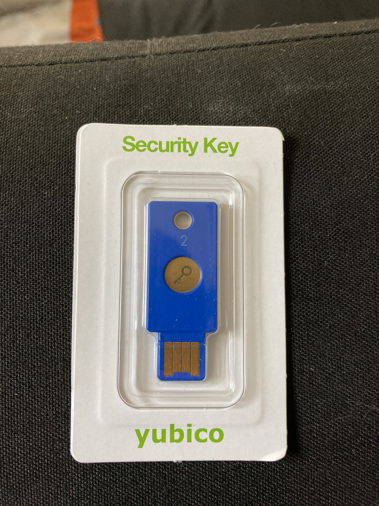

# YubiKey
#### Oliver Lynch: Journal three
##### 45/15/20

This is my YubiKey 2 factor authentication security key. YubiKeys are physical two factor authentication keys for computers and phones. Sometimes logging in with a password is not enough and you want extra security, thats where these come in handy. There are other ways of doing two factor authentication but using a Yubi Key is the most **efficient**. The Yuba key just needs to be  taped or insert into the device and its authenticated. When comparing it to email two factor or even google authenticate, the Yubi Key takes significantly less time. By taking less time than other methods the Yuba key is also very **useful** because it gets the job done simply and easily. 
