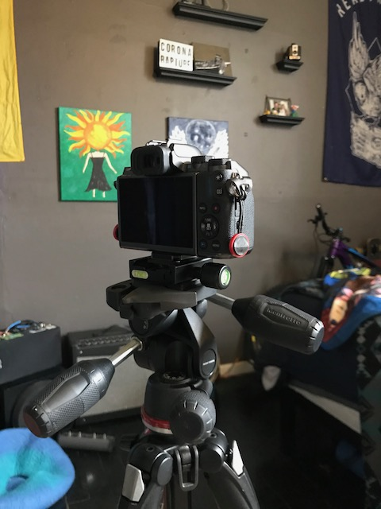
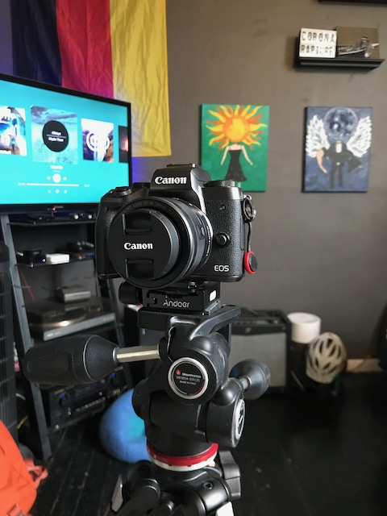

# Three point Tripod Head
#### Oliver Lynch: Journal two
##### 4/5/20

This is my Manfrotto Three point adjustable tripod head. There are many types of tripod heads out there on the market but ive found that this one is **effective** out of all the other tripod heads ive used. By effective I mean that I am easily able to get the desired results from my imputs to this device. With this tripod head I can easily make micro ajustments to the angle my camera sits on the tripod. Unlike other ball head tripod mounts that make you to adujst all axis simmotanously mine is able to only adjust one axis at a time. This reduces the amount of mistakes I make when adjusting it, making the device more **error tolerant** too. To me this mount solves all the problems ive ever had with any other camera mount. 
